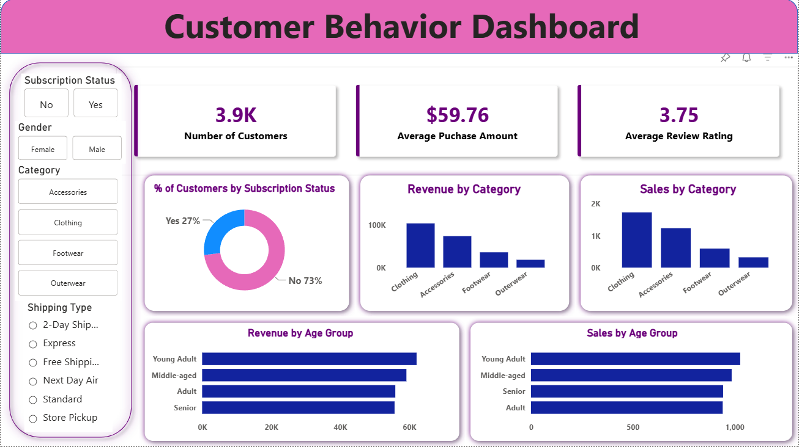

# 🛍️ Customer Shopping Behavior Analysis

An end-to-end Data Analytics project that explores customer shopping behavior using **Python**, **PostgreSQL**, and **Power BI**. The project focuses on uncovering customer purchasing patterns, product performance, subscription behavior, and revenue insights through data cleaning, SQL analysis, and an interactive dashboard.


## 📊 Dashboard Preview




## 🚀 Live Interactive Dashboard

👉 **View the Power BI Dashboard:**

https://app.powerbi.com/groups/me/reports/1b227d19-b701-413c-a1aa-fc720a4a42f3/83c871ca4b5d484584d6?experience=power-bi


## 📌 Project Overview

This project analyzes shopping behavior from **3,900 customer transactions** to answer important business questions such as:

- Which product categories generate the highest revenue?
- How does subscription status affect purchasing behavior?
- Which age groups spend the most?
- How do shipping methods influence customer purchases?
- Which customer segments are the most valuable?

The project follows a complete Data Analytics workflow:

1. Data Cleaning with Python
2. Data Storage & Analysis using PostgreSQL
3. Interactive Dashboard in Power BI
4. Business Recommendations


## 🛠️ Tools & Technologies

- 🐍 Python
  - Pandas
  - NumPy
- 🐘 PostgreSQL
- 📊 Power BI
- SQL
- Git & GitHub


## 📂 Dataset Information

- **Rows:** 3,900
- **Columns:** 18

### Dataset includes:

- Customer Demographics
- Product Categories
- Purchase Amount
- Review Ratings
- Subscription Status
- Shipping Type
- Discounts
- Purchase Frequency
- Seasons
- Previous Purchases


## 🔹 Data Cleaning (Python)

Performed the following preprocessing steps:

- Imported and explored the dataset
- Handled missing values
- Standardized column names
- Created Age Group feature
- Created Purchase Frequency feature
- Removed redundant columns
- Loaded cleaned data into PostgreSQL


## 🔹 SQL Analysis

Business questions answered include:

- Revenue by Gender
- Revenue by Age Group
- Subscriber vs Non-Subscriber Analysis
- Top Rated Products
- Top Products by Category
- Customer Segmentation
- Discount Analysis
- Shipping Type Comparison
- Repeat Customer Analysis


## 📈 Power BI Dashboard Features

The interactive dashboard includes:

- KPI Cards
  - Total Customers
  - Average Purchase Amount
  - Average Review Rating

- Revenue Analysis
- Sales Analysis
- Subscription Status Distribution
- Revenue by Age Group
- Sales by Age Group

### Interactive Filters

- Subscription Status
- Gender
- Category
- Shipping Type


## 💡 Business Insights

- Clothing generates the highest revenue.
- Non-subscribers represent the majority of customers.
- Young Adults contribute the largest share of revenue.
- Subscribers spend more on average.
- Standard shipping is the most frequently used shipping method.


## 📁 Project Structure

```
Customer-Shopping-Behavior-Analysis/
│
├── Dataset/
├── Python/
├── SQL/
├── Power BI/
├── dashboard.png
├── Customer Shopping Behavior Analysis.pdf
└── README.md
```


## 🎯 Business Recommendations

- Increase subscription membership through exclusive offers.
- Reward loyal customers with a loyalty program.
- Focus marketing campaigns on high-value age groups.
- Promote best-selling products.
- Optimize discount strategies to improve profitability.


## ⭐ Skills Demonstrated

- Data Cleaning
- Exploratory Data Analysis (EDA)
- Feature Engineering
- SQL Query Writing
- Database Management
- Data Visualization
- Dashboard Design
- Business Intelligence
- Business Analytics


## 👨‍💻 Author

**Sunny Sangwan**

GitHub: https://github.com/Sunny131105

LinkedIn: https://linkedin.com/in/sunny-sangwan-9a3633208/

---

## ⭐ If you found this project useful, don't forget to give it a Star!
